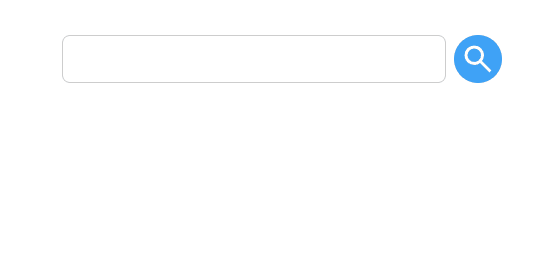

# 프리온보딩 챌린지 8월 사전미션

## :white_check_mark: 과제 내용

-   [x] 검색창 레이아웃 구현
-   [x] 검색창 입력시 자동완성 컴포넌트 출력
-   [x] 검색어와 자동완성 목록의 문자열이 일치하는 부분은 강조 표시

## :white_check_mark: 주요 구현 내용

### SearchInput({ autoCompleteData })

버튼과 입력창을 포함한 검색창 전체를 구현한 컴포넌트입니다
컴포넌트 외부를 클릭시 자동완성 컴포넌트가 출력되지 않습니다

### AutoCompleteBox({ children, show })

자동완성창의 외부 프레임입니다
레이아웃의 편의성과 확장성을 고려해 자동완성창 내용물과 별도의 컴포넌트로 구현했습니다

### GroupedAutoComplete({ data: autoCompleteData, keyword })

자동완성창의 내용물입니다
자동완성 목록을 정렬하고, 정렬된 배열에 따라 자동완성 선택지를 출력합니다

## :question: 질문 및 PR 포인트

-   변수 작명법이 적절한지 궁금합니다
-   더 직관적인 jsx 구조를 만들고 싶습니다
-   구현 로직은 함수 하나가 좀 많은 일을 한다 싶으면 쪼개놨는데, 일반적인 방식인지 궁금합니다
-   특히 GroupedAutoComplete를 집중적으로 리뷰하면 좋을 것 같습니다
